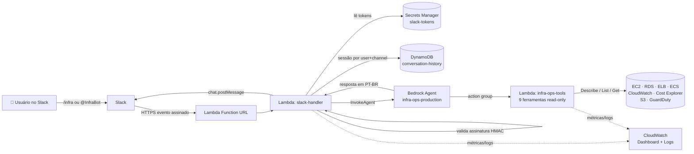

# agente-operacoes-aws — InfraBot 🤖

[](https://github.com/leonardodebs/agente-operacoes-aws/actions/workflows/ci.yml)
[](https://github.com/leonardodebs/agente-operacoes-aws/actions/workflows/deploy.yml)
[](https://www.python.org/)
[](https://www.terraform.io/)
[](https://aws.amazon.com/bedrock/)
[](https://api.slack.com/)
[](.github/workflows/deploy.yml)
[](tests/)

> Agente de IA em **produção** que responde, em português, perguntas sobre a
> infraestrutura AWS direto no **Slack**. Construído sobre **Amazon Bedrock
> Agents** (Claude Haiku 4.5), com infraestrutura 100% em **Terraform** e
> CI/CD via **GitHub Actions usando OIDC** — sem nenhuma credencial AWS armazenada.

Pergunte `@InfraBot quais instâncias EC2 estão rodando em us-west-2?` e receba a
resposta com dados **reais** da conta — sempre **somente leitura**, nunca uma
operação destrutiva.

---

## 🎬 Demo

> **GIF sugerido:** um canal do Slack onde o usuário digita
> `/infra qual foi o custo de EC2 nos últimos 7 dias?`. O InfraBot responde em
> segundos com o total em USD e um detalhamento por serviço; logo abaixo, uma
> *reply* na thread mostra `🔧 Ferramentas consultadas: cost-summary`.
> Em seguida o usuário menciona `@InfraBot tem algum alarme disparado agora?` e
> o bot lista os alarmes em estado `ALARM`. A conversa mantém contexto entre as
> perguntas (mesma sessão por usuário+canal).

---

## 🏗️ Arquitetura



**Fluxo:** Slack → Function URL → `slack-handler` (valida assinatura, carrega
sessão) → Bedrock Agent → `infra-ops-tools` (consulta a AWS) → Agent monta a
resposta → `slack-handler` posta de volta no Slack e salva o turno no DynamoDB.

---

## 🧰 Ferramentas do agente (somente leitura)

| # | Ferramenta | O que faz | Serviço AWS |
|---|------------|-----------|-------------|
| 1 | `list_ec2` | Lista instâncias EC2 (filtro por estado) | EC2 |
| 2 | `get_ec2_details` | Detalhes de uma instância + CPU da última hora | EC2 + CloudWatch |
| 3 | `list_rds` | Lista bancos RDS | RDS |
| 4 | `check_alb_health` | Saúde dos alvos de um ALB | ELBv2 |
| 5 | `get_cloudwatch_alarms` | Alarmes por estado (padrão `ALARM`) | CloudWatch |
| 6 | `list_ecs_services` | Serviços ECS e contagem de tasks | ECS |
| 7 | `get_cost_summary` 🆕 | Custo dos últimos 7 dias por serviço | Cost Explorer |
| 8 | `list_s3_buckets_summary` 🆕 | Resumo dos buckets S3 | S3 |
| 9 | `check_guardduty_findings` 🆕 | Achados de segurança severidade ≥ MEDIUM | GuardDuty |

As três últimas são as **expansões** sobre as 7 ferramentas do laboratório
original (Cost Explorer e GuardDuty entram aqui pela primeira vez).

---

## 💬 Conversas de exemplo

```
Você:      /infra Quais instâncias EC2 estão rodando em us-west-2?
InfraBot:  Encontrei 3 instâncias em estado running na us-west-2:
           • i-0a1b2c (t3.medium, "api-prod") — IP 10.0.1.20
           • i-0d4e5f (t3.small,  "worker")   — IP 10.0.1.45
           • i-0g7h8i (t3.micro,  "bastion")  — IP 10.0.2.10
           🔧 Ferramentas consultadas: list-ec2

Você:      @InfraBot Tem algum alarme disparado agora?
InfraBot:  Sim, há 1 alarme em estado ALARM:
           • "cpu-alta-api-prod" — CPUUtilization acima de 80% (AWS/EC2)
           🔧 Ferramentas consultadas: cloudwatch-alarms

Você:      @InfraBot Qual foi o custo de EC2 nos últimos 7 dias?
InfraBot:  Nos últimos 7 dias o custo total foi US$ 42.18.
           Amazon EC2 respondeu por US$ 27.90 desse total.
           🔧 Ferramentas consultadas: cost-summary

Você:      @InfraBot Pode parar a instância i-0a1b2c?
InfraBot:  Não posso fazer isso — sou estritamente somente leitura e apenas
           consulto a infraestrutura. Posso, por exemplo, mostrar os detalhes
           e o uso de CPU dessa instância.
```

---

## 🚀 Setup

### Pré-requisitos
- Conta AWS com acesso ao Bedrock (modelo Claude Haiku 4.5 habilitado na região)
- Terraform ≥ 1.5, AWS CLI configurada, Python 3.12
- Um workspace do Slack onde você possa criar apps

### 1. Provisionar a infraestrutura

```bash
cd terraform
cp terraform.tfvars.example terraform.tfvars   # ajuste github_owner/repo
terraform init
terraform apply
```

Anote os outputs, principalmente `slack_function_url` e `github_actions_role_arn`.

### 2. Criar o app no Slack

1. https://api.slack.com/apps → **Create New App** → *From scratch*.
2. **OAuth & Permissions** → adicione os *Bot Token Scopes*:
   - `chat:write` — postar mensagens
   - `commands` — habilitar o slash command
   - `app_mentions:read` — receber `@InfraBot`
3. **Slash Commands** → **Create**: comando `/infra`, *Request URL* = a
   `slack_function_url` do Terraform.
4. **Event Subscriptions** → **Enable**, *Request URL* = a mesma URL
   (o handler responde ao desafio `url_verification` automaticamente) →
   *Subscribe to bot events*: `app_mention`.
5. **Install to Workspace** e copie o **Bot User OAuth Token** (`xoxb-...`) e o
   **Signing Secret** (em *Basic Information*).

### 3. Preencher os tokens no Secrets Manager

Os segredos **nunca** ficam no código nem em variáveis de ambiente versionadas:

```bash
aws secretsmanager put-secret-value \
  --secret-id slack-tokens \
  --secret-string '{"SLACK_BOT_TOKEN":"xoxb-...","SLACK_SIGNING_SECRET":"..."}' \
  --region us-west-2
```

### 4. Habilitar o CI/CD (OIDC, sem chaves)

No repositório GitHub, crie **um único secret**: `AWS_DEPLOY_ROLE_ARN` com o
valor de `github_actions_role_arn`. Não é uma credencial — é apenas o ARN da
role que o GitHub assume via OIDC. A partir daí:
- **PRs** disparam o `ci.yml` (checkov, fmt, validate, pytest).
- **Merge na `main`** dispara o `deploy.yml` (apply + atualização das Lambdas + smoke test).

---

## 🔒 Segurança

- **Verificação de assinatura do Slack** — toda requisição é validada por
  HMAC-SHA256 (`v0`) com proteção anti-replay (janela de 5 min) e comparação em
  tempo constante. Requisições inválidas recebem `401` antes de qualquer
  processamento. Veja `assinatura_valida` em
  [lambda/slack/handler.py](lambda/slack/handler.py).
- **IAM de menor privilégio** — a Lambda de ferramentas só tem ações
  `Describe/List/Get` (nenhuma escrita/delete). A `slack-handler` só pode
  `InvokeAgent` no alias específico, `Get/PutItem` na tabela e ler **um** secret.
- **Read-only reforçado no agente** — o *system prompt* instrui o agente a
  recusar qualquer operação de mutação; a defesa real, porém, é o IAM acima.
- **Secrets Manager** — tokens do Slack ficam cifrados e fora do código; o
  Terraform usa `ignore_changes` para nunca sobrescrever o valor real.
- **OIDC, sem credenciais armazenadas** — o GitHub Actions assume uma role via
  *web identity* de curta duração; a *trust policy* restringe ao repositório e à
  branch `main`. Nenhuma `AWS_ACCESS_KEY_ID` no repositório.
- **DynamoDB** com criptografia em repouso, PITR e TTL nas conversas.

---

## 🧪 Testes

```bash
make install   # cria deps
make test      # pytest tests/ -v
```

- `tests/test_tools.py` — mocka a AWS (moto) e valida o schema de cada ferramenta,
  incluindo Cost Explorer e GuardDuty.
- `tests/test_slack.py` — fluxo completo `requisição → agente → Slack → DynamoDB`
  com tudo mockado.
- `tests/test_security.py` — garante que assinaturas inválidas/antigas são
  rejeitadas.

> CI verde é pré-requisito para considerar o projeto concluído.

---

## 🎓 Skills demonstradas

- **Amazon Bedrock Agents** — agente com action group e schema OpenAPI
- **Integração com Slack** — slash command, app mention, assinatura, threads
- **AWS Lambda** (Python 3.12) — ferramentas e webhook, Function URL
- **IAM** — menor privilégio, roles separadas, trust policies
- **Terraform** — toda a infraestrutura como código
- **GitHub Actions OIDC** — CI/CD sem credenciais armazenadas
- **CI/CD** — checkov, terraform validate/fmt, pytest, smoke test no deploy
- **Observabilidade** — DynamoDB para histórico, CloudWatch Dashboard e logs

---

## 📁 Estrutura

```
agente-operacoes-aws/
├── lambda/
│   ├── tools/handler.py      # 9 ferramentas read-only (+ schema.json)
│   └── slack/handler.py      # webhook do Slack → Bedrock Agent
├── terraform/                # agent, lambdas, dynamodb, secrets, dashboard, oidc
├── tests/                    # test_tools / test_slack / test_security
└── .github/workflows/        # ci.yml (PR) e deploy.yml (main, OIDC)
```
