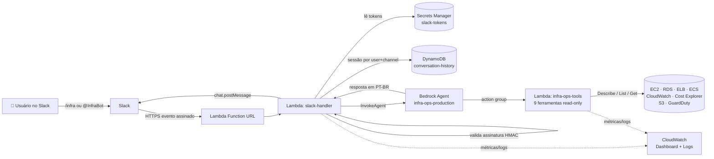

# Documentação de Arquitetura — agente-operacoes-aws

Detalhamento técnico da arquitetura do InfraBot: componentes, fluxo de dados,
decisões de design, modelo de segurança e custos.

---

## 1. Visão geral

O InfraBot é um agente de IA **somente leitura** que responde, em português,
perguntas sobre a infraestrutura AWS direto no Slack. O raciocínio (qual
ferramenta chamar e como redigir a resposta) fica num **Amazon Bedrock Agent**;
a execução das consultas fica em **funções Lambda**. Nenhuma credencial AWS é
exposta a usuários finais — eles interagem apenas pelo Slack.



---

## 2. Componentes

### 2.1 Lambda `slack-handler` (webhook)
- **Fonte:** [lambda/slack/handler.py](../lambda/slack/handler.py)
- **Runtime:** Python 3.12 · 512 MB · timeout 60s
- **Exposição:** Lambda Function URL (`authorization_type = NONE`) — sem API Gateway.
- **Responsabilidades:**
  1. Validar a assinatura HMAC-SHA256 de toda requisição do Slack.
  2. Responder ao desafio `url_verification` (configuração do app).
  3. Tratar `/infra <pergunta>` (slash command, form-urlencoded) e `@InfraBot`
     (app mention, JSON da Events API).
  4. Carregar/gravar a sessão da conversa no DynamoDB.
  5. Invocar o Bedrock Agent e postar a resposta no Slack (resposta principal +
     reply na thread com as ferramentas usadas).
- **Variáveis de ambiente:** `BEDROCK_AGENT_ID`, `BEDROCK_AGENT_ALIAS_ID`,
  `HISTORY_TABLE`, `SLACK_SECRET_ARN`, `DEFAULT_REGION`.

### 2.2 Lambda `infra-ops-tools` (action group)
- **Fonte:** [lambda/tools/handler.py](../lambda/tools/handler.py) ·
  schema [lambda/tools/schema.json](../lambda/tools/schema.json)
- **Runtime:** Python 3.12 · 256 MB · timeout 30s
- **Responsabilidades:** implementar as 9 ferramentas read-only. O Bedrock
  envia um evento com `apiPath`; a função roteia para a ferramenta, executa a
  chamada boto3 e devolve o envelope esperado pelo agente.
- **Qualidades de produção:** logging JSON estruturado, retry com backoff
  exponencial em erros transitórios (`Throttling`, `RequestLimitExceeded`, etc.)
  e tratamento de erro por ferramenta (o agente sempre recebe envelope válido).

| # | `apiPath` | Ferramenta | Serviço AWS |
|---|-----------|------------|-------------|
| 1 | `/list-ec2` | `list_ec2` | EC2 |
| 2 | `/ec2-details` | `get_ec2_details` | EC2 + CloudWatch |
| 3 | `/list-rds` | `list_rds` | RDS |
| 4 | `/check-alb-health` | `check_alb_health` | ELBv2 |
| 5 | `/cloudwatch-alarms` | `get_cloudwatch_alarms` | CloudWatch |
| 6 | `/list-ecs-services` | `list_ecs_services` | ECS |
| 7 | `/cost-summary` | `get_cost_summary` | Cost Explorer (`us-east-1`) |
| 8 | `/list-s3-buckets` | `list_s3_buckets_summary` | S3 |
| 9 | `/guardduty-findings` | `check_guardduty_findings` | GuardDuty |

### 2.3 Bedrock Agent `infra-ops-production`
- **Fonte:** [terraform/agent.tf](../terraform/agent.tf)
- **Modelo:** `us.anthropic.claude-haiku-4-5-20251001-v1:0` (inference profile
  cross-region — o Claude 3 Haiku original virou Legacy e está bloqueado para
  novos usuários).
- **Action group:** `aws-infrastructure-tools`, conectado à `infra-ops-tools`
  via schema OpenAPI 3.0 inline.
- **Alias:** `live` — ponto de invocação estável usado pela `slack-handler`.
- **System prompt:** define persona "InfraBot", idioma PT-BR e **regras
  inegociáveis de somente leitura** (recusa qualquer pedido de mutação).
- **TTL de sessão ociosa:** 600s.

### 2.4 DynamoDB `conversation-history`
- **Fonte:** [terraform/dynamodb.tf](../terraform/dynamodb.tf)
- **Chave de partição:** `conversation_key` = `"{user_id}#{channel_id}"`.
- **Item:** `session_id`, `last_question`, `last_answer`, `updated_at`, `ttl`.
- **Billing:** PAY_PER_REQUEST. **TTL:** 30 dias. **PITR** e **criptografia** ativos.
- **Função:** continuidade de sessão — o mesmo `session_id` é reenviado ao
  Bedrock para manter contexto entre perguntas do mesmo usuário no mesmo canal.

### 2.5 Secrets Manager `slack-tokens`
- **Fonte:** [terraform/secrets.tf](../terraform/secrets.tf)
- **Conteúdo:** JSON com `SLACK_BOT_TOKEN` e `SLACK_SIGNING_SECRET`.
- O Terraform cria apenas um **placeholder** e usa `ignore_changes` para nunca
  sobrescrever o valor real (preenchido fora do IaC via CLI).

### 2.6 CloudWatch Dashboard
- **Fonte:** [terraform/dashboard.tf](../terraform/dashboard.tf)
- **Widgets:** invocações das Lambdas, erros, latência p50/p99 da `slack-handler`
  (proxy da latência do Bedrock), throttles e concorrência.

---

## 3. Fluxo de uma requisição (passo a passo)

1. Usuário digita `/infra quais EC2 estão rodando?` ou menciona `@InfraBot`.
2. O Slack faz um POST HTTPS para a **Function URL** com cabeçalhos
   `X-Slack-Signature` e `X-Slack-Request-Timestamp`.
3. A `slack-handler` lê os tokens do **Secrets Manager** (com cache em memória) e
   **valida a assinatura**. Inválida → `401` imediato.
4. Identifica o tipo (slash command vs. evento) e extrai `user_id`,
   `channel_id`, texto da pergunta. Retries do Slack (`X-Slack-Retry-Num`) são
   ignorados para não duplicar respostas.
5. Busca/gera o `session_id` no **DynamoDB** (chave `user#channel`).
6. Chama `invoke_agent` no **Bedrock**; agrega o stream em texto e coleta os
   `apiPath` das ferramentas usadas a partir do *trace*.
7. O agente, internamente, chama a `infra-ops-tools`, que consulta a AWS e
   retorna os dados reais.
8. A `slack-handler` posta a resposta no Slack (`chat.postMessage`) e, se houve
   ferramentas, uma reply na thread listando-as.
9. Grava o turno (pergunta/resposta) no DynamoDB e renova o TTL.

> **Nota sobre os 3s do Slack:** a Function URL responde de forma síncrona. Em
> respostas mais longas do Bedrock, o usuário pode ver o aviso de timeout do
> Slack enquanto a mensagem é postada via Web API logo em seguida. Evolução
> natural: ack imediato + processamento assíncrono (invocação Lambda async ou
> SQS). Ver Runbook, seção de troubleshooting.

---

## 4. Decisões de design

| Decisão | Por quê |
|---------|---------|
| **Lambda Function URL** em vez de API Gateway | Webhook único e simples; menos componentes e custo. A autenticidade vem da assinatura HMAC, não de IAM/authorizer. |
| **Duas Lambdas separadas** (slack vs. tools) | Separação de responsabilidades e de IAM: a `tools` só lê AWS; a `slack` só fala com Bedrock/DynamoDB/Secrets. |
| **Bedrock Agent** em vez de orquestração manual | O agente decide qual ferramenta chamar e redige a resposta; reduz código de orquestração. |
| **Read-only em duas camadas** | System prompt recusa mutações *e* o IAM não concede permissão de escrita. Defesa em profundidade. |
| **Sessão no DynamoDB** | Continuidade de conversa por usuário+canal, com expiração automática (TTL). |
| **Secrets Manager** | Tokens fora do código e do estado do Terraform. |
| **OIDC no CI/CD** | Elimina chaves AWS de longa duração no GitHub. |
| **Inference profile cross-region** | Maior disponibilidade do modelo; IAM libera profile + modelo base. |

---

## 5. Modelo de segurança (resumo)

- **Borda:** validação HMAC-SHA256 (`v0`) com anti-replay (janela 5 min) e
  comparação em tempo constante (`hmac.compare_digest`).
- **IAM de menor privilégio:**
  - `infra-ops-tools` → apenas `Describe*/List*/Get*` (EC2, RDS, ECS, ELB,
    CloudWatch, Cost Explorer, GuardDuty, S3). Nenhuma escrita/delete.
  - `slack-handler` → `bedrock:InvokeAgent` (apenas o alias), `dynamodb:Get/PutItem`
    (apenas a tabela) e `secretsmanager:GetSecretValue` (apenas o secret).
  - Bedrock Agent role → `InvokeModel` + `InvokeFunction` na Lambda de tools,
    com `aws:SourceAccount` na trust policy (anti *confused deputy*).
- **CI/CD:** role `github-actions-deploy` assumida via OIDC, com trust restrita a
  `repo:{owner}/{repo}` nas refs `main` e `pull_request`.
- **Dados:** DynamoDB com criptografia em repouso, PITR e TTL.

Detalhes em [terraform/iam.tf](../terraform/iam.tf) e na seção *Segurança* do
[README](../README.md).

---

## 6. Observabilidade

- **Logs estruturados (JSON)** em ambas as Lambdas — buscáveis no CloudWatch
  Logs Insights por campo (`event`, `api_path`, `duracao_ms`, etc.).
- **Dashboard** `agente-operacoes-aws` com invocações, erros, latência e throttles.
- **Retenção** de logs: 14 dias (variável `log_retention_days`).

Exemplo de consulta no Logs Insights:
```
fields @timestamp, event, api_path, duracao_ms
| filter event = "ferramenta_ok"
| sort duracao_ms desc
```

---

## 7. Custos (ordem de grandeza)

Arquitetura serverless e *pay-per-use* — custo praticamente proporcional ao uso:

- **Lambda:** dentro do free tier para volumes baixos/médios de perguntas.
- **DynamoDB:** PAY_PER_REQUEST — centavos para histórico de conversas.
- **Bedrock (Claude Haiku 4.5):** principal driver; cobrado por token de
  entrada/saída por invocação do agente.
- **Cost Explorer:** custo por chamada de API (`GetCostAndUsage`).
- **Secrets Manager:** custo fixo baixo por secret/mês.
- **CloudWatch:** logs + dashboard, proporcional ao volume.

Para uma equipe pequena, o custo mensal é dominado pelas chamadas ao Bedrock.

---

## 8. Pontos de evolução

- Ack imediato + processamento assíncrono (resolver o limite de 3s do Slack).
- Cache de respostas frequentes (ex.: custo do dia) para reduzir chamadas ao Bedrock.
- Backend remoto de estado do Terraform (S3 + DynamoDB lock) para uso em equipe.
- Alarmes do CloudWatch sobre `Errors`/`Throttles` notificando um canal do Slack.
- Suporte multi-conta/multi-região com *assume role* nas ferramentas.
